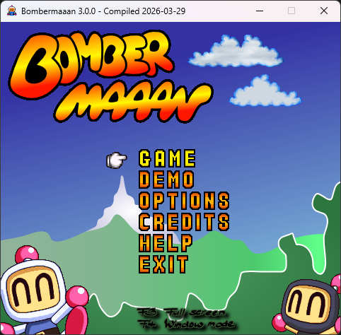
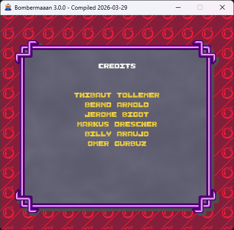

[](https://www.gnu.org/licenses/gpl-3.0)


# Bombermaaan-CS

`Bombermaaan-CS` is a C# port of the original Bombermaaan project.

👉 **Download latest release:**\
[⬇️ Download
Setup](https://github.com/m-omer-gurbuz/Bombermaaan-CS/releases/download/v3.0.0/Bombermaaan_3.0.0_setup_win64.exe)

------------------------------------------------------------------------

## 🎮 Screenshots

   


------------------------------------------------------------------------

## 🚀 Current Status

-   Classic local Bomberman-style gameplay is working in the C# port.
-   Default controls and custom control mapping are supported.
-   Windows packaging support is included.
-   Version is currently `3.0.0`.

------------------------------------------------------------------------

## 📁 Project Layout

-   `Bombermaaan`: main C# game project\
-   `installers`: Windows installer scripts\
-   `screenshots`: repo images

------------------------------------------------------------------------

## 🧰 Requirements

-   Windows
-   .NET SDK 8+
-   SDL2 runtime DLLs

------------------------------------------------------------------------

## 🛠️ Build

``` powershell
dotnet build .\Bombermaaan.sln
```

------------------------------------------------------------------------

## ▶️ Run

``` powershell
dotnet run --project .\Bombermaaan\Bombermaaan.csproj
```

------------------------------------------------------------------------

## 🎮 Default Controls

-   Arrow keys + `X` / `Z`
-   Numpad support
-   Multiple keyboard layouts

------------------------------------------------------------------------

## 📦 Packaging

``` powershell
powershell -ExecutionPolicy Bypass -File .\installers\BuildInstaller.ps1
```

------------------------------------------------------------------------

## 🔗 Original Project & Resources

-   https://sourceforge.net/projects/bombermaaan/
-   https://bombermaaan.sourceforge.net/
-   https://github.com/vimr/Bombermaaan
-   https://github.com/talregev/Bombermaaan

------------------------------------------------------------------------

## ❤️ Credits

-   Original developers\
-   Community contributors\
-   2026 Ömer Gürbüz

------------------------------------------------------------------------

## 📜 License

GPL v3
