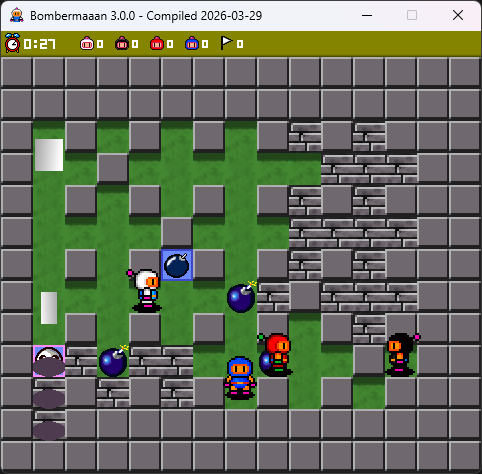
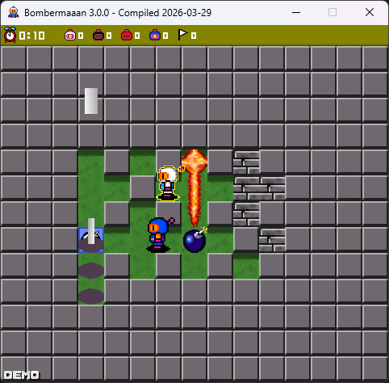
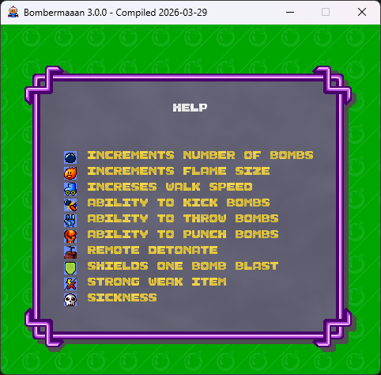

[](https://www.gnu.org/licenses/gpl-3.0)

# Bombermaaan-CS

`Bombermaaan-CS` is a C# port of the original Bombermaaan project. The goal of this repository is to preserve the classic game while moving the codebase to a modern .NET and SDL-based Windows build pipeline.

This port keeps the original gameplay, assets, and overall structure as close to the upstream project as possible, while adapting the implementation for C#.

## Screenshots







## Current Status

- Classic local Bomberman-style gameplay is working in the C# port.
- Default controls and custom control mapping are supported.
- Windows packaging support is included through `dotnet publish` and Inno Setup scripts.
- Version is currently `3.0.0`.

## Project Layout

- [Bombermaaan](C:/Users/Omer/source/repos/Bombermaaan-CS/Bombermaaan): main C# game project
- [installers](C:/Users/Omer/source/repos/Bombermaaan-CS/installers): Windows installer scripts and packaging helpers
- [screenshots](C:/Users/Omer/source/repos/Bombermaaan-CS/screenshots): repository screenshots for GitHub

## Requirements

- Windows
- .NET SDK 8+
- SDL2 runtime DLLs

The native SDL files used by the project are already included in the repository under the main project folder.

## Build

From the repository root:

```powershell
dotnet build .\Bombermaaan.sln
```

## Run

You can run the game from Visual Studio or from the command line:

```powershell
dotnet run --project .\Bombermaaan\Bombermaaan.csproj
```

To store dynamic files such as `config.xml` and `log.txt` in `%APPDATA%\Bombermaaan`, run with:

```powershell
dotnet run --project .\Bombermaaan\Bombermaaan.csproj -- --use-appdata-dir
```

You can also use:

```powershell
dotnet run --project .\Bombermaaan\Bombermaaan.csproj -- --help
```

## Default Controls

- Keyboard 1: Arrow keys + `X` / `Z`
- Keyboard 2: Numpad `8` `5` `4` `6` + `Y` / `T`
- Keyboard 3: `I` `K` `J` `L` + `8` / `7`
- Keyboard 4: `H` `N` `B` `M` + `5` / `4`
- Keyboard 5: `R` `F` `D` `G` + `1` / `2`

Menu controls:

- `Up` / `Down`: move selection
- `Left` / `Right`: change value
- `Backspace`: previous screen
- `Enter` / `Space`: confirm
- `Escape`: back / pause

## Packaging

Windows packaging files live in [installers](C:/Users/Omer/source/repos/Bombermaaan-CS/installers).

To prepare a release folder:

```powershell
powershell -ExecutionPolicy Bypass -File .\installers\BuildInstaller.ps1 -SkipInstaller
```

To build a setup executable as well, install Inno Setup 6 and run:

```powershell
powershell -ExecutionPolicy Bypass -File .\installers\BuildInstaller.ps1
```

The generated release files are placed under `releases/win-x64/`, and installer output goes to `installers/output/`.

## Credits

- 2000-2002, 2007 Thibaut Tollemer
- 2007, 2008 Bernd Arnold
- 2008 Jerome Bigot
- 2008 Markus Drescher
- 2016 Billy Araujo
- 2026 Ömer Gürbüz

This repository is based on the original Bombermaaan project and its later community-maintained versions.

## License

Bombermaaan is free software: you can redistribute it and/or modify it under the terms of the GNU General Public License as published by the Free Software Foundation, either version 3 of the License, or (at your option) any later version.

See [COPYING.txt](./COPYING.txt) for the full license text.
